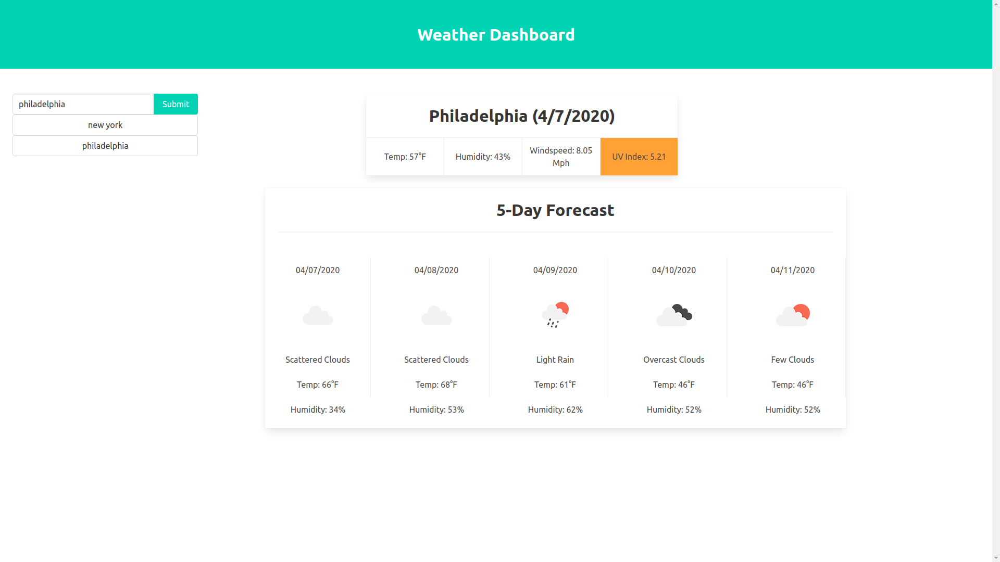

# Project Name: Weather Forecast Application

# Link to application:
https://dolinay1.github.io/weather-forecast-app/index.html
https://github.com/dolinay1/weather-forecast-app

# Description:
The application is a simple weather app that displays weather data based on the user's search for a city. The user enters a valid name into the the search field and has the data for that particular city displayed.
The data displays the weather for the current day first which includes the date, temperature, humidity, windspeed, and UV index.
Also displayed is the 5 day forecast for the week including the date, weather description, temperature, humidity, and a weather icon corresponding to the weather description.
The UV index changes with four different colors depending on the serverity of the index.
The users previous searches are displayed in below the field submission.

# Technologies Used:
HTML, Javascript, CSS, Bulma, Openweathermap API

# Screenshots:

